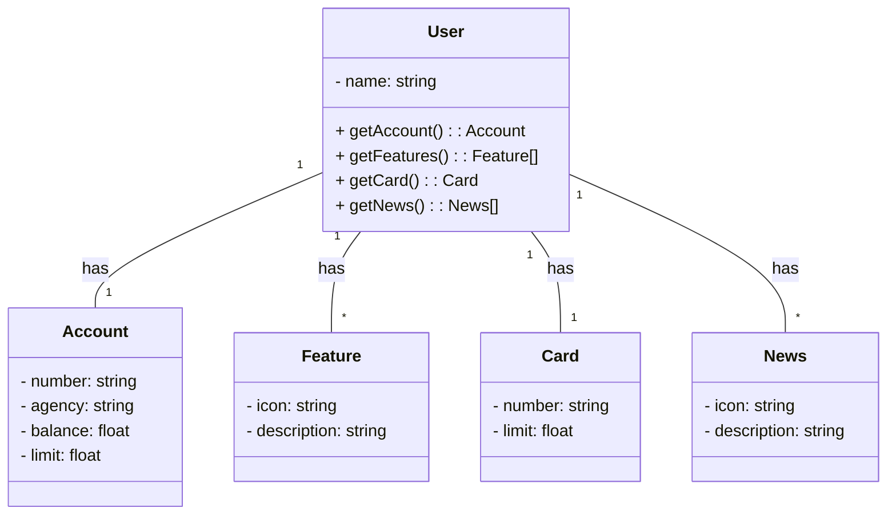

<h1 align="center">Bradesco Java Cloud Native 2025</h1>

  

## Descrição 

Java RESTful API criada para o Bradesco Java Cloud Native.

## Diagrama de Classes

## Ferramentas e tecnologias

## Ambiente de Desenvolvimento
Este projeto foi desenvolvido e testado nas seguintes condições:

* Versão Java: [Java 17.0.4.]
* IDE: [VSCode] 
* Sistema Operacional: [Windows 11] 
